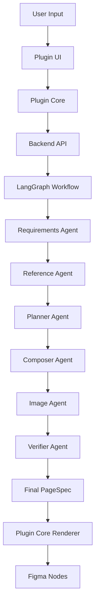

# Growth99 Figma Plugin - Technical Architecture & Function Documentation

## Table of Contents
1. [Architecture Overview](#architecture-overview)
2. [Frontend-Backend Communication Flow](#frontend-backend-communication-flow)
3. [AI Component Generation Pipeline](#ai-component-generation-pipeline)
4. [Detailed Component Breakdown](#detailed-component-breakdown)
5. [Data Flow Visualization](#data-flow-visualization)
6. [Areas for Improvement](#areas-for-improvement)

## Architecture Overview

The Growth99 Figma Plugin consists of three main layers:

```
┌─────────────────────────────────────────────────────────┐
│                    FIGMA PLUGIN UI                       │
│                    (ui.tsx, ui.html)                     │
├─────────────────────────────────────────────────────────┤
│                  FIGMA PLUGIN CORE                       │
│                      (code.ts)                           │
│              [Bridge: postMessage API]                   │
├─────────────────────────────────────────────────────────┤
│                   FASTAPI BACKEND                        │
│                     (main.py)                            │
│         [LangGraph Agents + GPT-5 Integration]          │
└─────────────────────────────────────────────────────────┘
```

## Frontend-Backend Communication Flow

### 1. User Interaction → UI Layer

**File**: `src/ui.tsx`
```javascript
// User clicks "Generate First Page" button
generateBtn.onclick = () => {
  parent.postMessage({
    pluginMessage: { 
      type: 'GenerateFirstPage',
      brief: briefEl.value,
      model: modelEl.value,
      useAiImages: aiImagesEl.checked
    }
  }, '*')
}
```

### 2. UI → Plugin Core Message Bridge

**File**: `src/bridge.ts`
```typescript
// Message received in Plugin Core
export function onUIMessage(handler: (msg: any) => void) {
  figma.ui.onmessage = handler
}
```

### 3. Plugin Core → Backend API Call

**File**: `src/code.ts` (Lines 12-67)
```typescript
onUIMessage(async (msg: UIToCoreMessage) => {
  if (msg.type === 'GenerateFirstPage') {
    // Step 1: Connect to backend
    const backendUrl = 'http://localhost:8000'
    
    // Step 2: Call LangGraph workflow endpoint
    const response = await fetch(`${backendUrl}/v1/generate/complete`, {
      method: 'POST',
      headers: { 'Content-Type': 'application/json' },
      body: JSON.stringify({
        user_input: "Create a professional medical spa homepage",
        reference_urls: [],
        page_type: "Home",
        use_ai_images: false,
        model_name: "gpt-5"
      })
    })
    
    // Step 3: Process AI-generated specification
    const result = await response.json()
    
    // Step 4: Render in Figma
    await renderGeneratedPage(result.final_page_spec)
  }
})
```

### 4. Backend Processing Chain

**File**: `backend/main.py` (Lines 237-271)
```python
@app.post("/v1/generate/complete")
async def generate_complete_page(request):
    # Creates LangGraph workflow with GPT-5
    workflow = create_workflow("gpt-5")
    
    # Executes 7-step agent pipeline
    result = await workflow.generate_page(
        chat_history=request.get("chat_history"),
        user_input=request.get("user_input"),
        reference_urls=request.get("reference_urls"),
        page_type=request.get("page_type"),
        use_ai_images=request.get("use_ai_images")
    )
    
    return result  # Contains final_page_spec with Figma nodes
```

## AI Component Generation Pipeline

### Step 1: Requirements Processing
**Agent**: `RequirementsAgent` (`backend/agents/requirements_agent.py`)
```python
# GPT-5 analyzes user input and creates structured Brief
async def process(self, chat_history, user_input) -> Brief:
    # Uses GPT-5 to extract:
    # - Industry (healthcare, medical spa, etc.)
    # - Business type
    # - Tone and brand personality
    # - Key services
    # - Target audience
    # - Primary CTA
```

### Step 2: Reference Analysis
**Agent**: `ReferenceAgent` (`backend/agents/reference_agent.py`)
```python
# Firecrawl + GPT-5 extracts design system from URLs
async def analyze_references(self, urls) -> DesignSystem:
    # 1. Firecrawl scrapes website content
    # 2. GPT-5 analyzes and extracts:
    #    - Colors (primary, text, background)
    #    - Typography (fonts, sizes, weights)
    #    - Spacing scale
    #    - Component styles
```

### Step 3: Page Planning
**Agent**: `PlannerAgent` (`backend/agents/planner_agent.py`)
```python
# GPT-5 creates high-level page structure
async def create_page_spec(self, brief, design_system) -> PageSpec:
    # Generates sections:
    # - Header (nav, logo, CTA)
    # - Hero (title, subtitle, image)
    # - Services (cards, descriptions)
    # - Testimonials
    # - Footer
```

### Step 4: Component Composition
**Agent**: `ComposerAgent` (`backend/agents/composer_agent.py`)
```python
# GPT-5 converts PageSpec to detailed Figma nodes
async def compose_page(self, page_spec, design_system) -> ComposedPageSpec:
    # Creates Figma node hierarchy:
    {
        "type": "FRAME",
        "name": "Hero_Container",
        "properties": {
            "layoutMode": "HORIZONTAL",
            "itemSpacing": 64,
            "paddingTop": 80,
            "fills": [{"type": "SOLID", "color": {"r": 1, "g": 1, "b": 1}}]
        },
        "children": [
            {
                "type": "TEXT",
                "name": "Hero_Title",
                "properties": {
                    "characters": "Transform Your Skin",
                    "fontName": {"family": "Inter", "style": "Bold"},
                    "fontSize": 44
                }
            }
        ]
    }
```

### Step 5: Image Generation (Optional)
**Agent**: `ImageAgent` (`backend/agents/image_agent.py`)
```python
# Replicate + GPT-5 generates AI images
async def generate_images(self, image_slots) -> List[GeneratedImage]:
    # 1. GPT-5 enhances prompts for medical context
    # 2. Replicate generates images
    # 3. Returns URLs for Figma placement
```

### Step 6: Verification
**Agent**: `VerifierAgent` (`backend/agents/verifier_agent.py`)
```python
# GPT-5 validates quality and compliance
async def verify_page(self, composed_spec) -> VerificationResult:
    # Checks:
    # - Healthcare compliance
    # - Accessibility (contrast, font sizes)
    # - Performance (node count)
    # - Design consistency
```

## Detailed Component Breakdown

### Frontend Components

#### UI Layer (`src/ui.tsx`)
- **Purpose**: User interface for chat, settings, and controls
- **Key Elements**:
  - Chat textarea for requirements
  - Model selector dropdown
  - AI images toggle
  - Generate/Redesign buttons
  - Progress log display

#### Plugin Core (`src/code.ts`)
- **Purpose**: Figma API interaction and node rendering
- **Key Functions**:
  - `renderGeneratedPage()`: Main rendering orchestrator
  - `createFigmaNode()`: Recursive node creation
  - `applyFrameProperties()`: Auto-layout configuration
  - `applyTextProperties()`: Typography application
  - `applyGeneratedImages()`: AI image placement

#### Renderers (`src/renderers/`)
- **components.ts**: Section-specific rendering (Header, Hero, Footer)
- **layout.ts**: Auto-layout frame creation
- **text.ts**: Text node styling
- **image.ts**: Image fill management

### Backend Components

#### LangGraph Workflow (`backend/workflows/page_generation_workflow.py`)
```python
class PageGenerationWorkflow:
    def _build_workflow(self):
        workflow = StateGraph(WorkflowState)
        
        # Add all 6 agents as nodes
        workflow.add_node("requirements", self._requirements_step)
        workflow.add_node("reference_analysis", self._reference_analysis_step)
        workflow.add_node("planning", self._planning_step)
        workflow.add_node("composition", self._composition_step)
        workflow.add_node("image_generation", self._image_generation_step)
        workflow.add_node("verification", self._verification_step)
        
        # Define execution order
        workflow.add_edge(START, "requirements")
        workflow.add_edge("requirements", "reference_analysis")
        workflow.add_edge("reference_analysis", "planning")
        # ... continues through all steps
```

#### API Endpoints (`backend/main.py`)
- `/v1/session/start`: Initialize session with Supabase
- `/v1/reference/analyze`: Firecrawl URL analysis
- `/v1/page/plan`: Direct page planning
- `/v1/images/generate`: Replicate image generation
- `/v1/generate/complete`: Full workflow execution

## Data Flow Visualization



### Detailed Node Rendering Process

1. **Receive PageSpec from Backend**
```javascript
{
  "pageName": "Medical Spa Homepage",
  "figmaNodes": [...],  // Detailed node specifications
  "images": [...],      // Generated image URLs
  "metadata": {...}     // Design system, verification
}
```

2. **Parse and Create Nodes**
```javascript
// code.ts - createFigmaNode() function
switch (nodeSpec.type) {
  case 'FRAME':
    const frame = figma.createFrame()
    applyFrameProperties(frame, nodeSpec.properties)
    // Recursively add children
    
  case 'TEXT':
    const text = figma.createText()
    await figma.loadFontAsync(fontName)
    text.characters = nodeSpec.properties.characters
    
  case 'RECTANGLE':
    const rect = figma.createRectangle()
    // Used for images and backgrounds
}
```

3. **Apply Auto-Layout**
```javascript
frame.layoutMode = 'VERTICAL'
frame.primaryAxisSizingMode = 'AUTO'
frame.itemSpacing = 32
frame.paddingTop = 64
```

4. **Place AI-Generated Images**
```javascript
// Find placeholder rectangles by plugin data
const role = node.getPluginData('role')
if (role === 'hero') {
  // Apply generated hero image
  node.fills = [{
    type: 'IMAGE',
    scaleMode: 'FILL',
    imageHash: image.hash
  }]
}
```

## Areas for Improvement

### 1. **Performance Optimizations**
- **Current Issue**: Sequential agent processing can be slow
- **Solution**: Parallelize independent agents (Reference + Requirements)
- **Implementation**:
```python
# Run requirements and reference analysis in parallel
requirements_task = asyncio.create_task(requirements_agent.process())
reference_task = asyncio.create_task(reference_agent.analyze())
brief, design_system = await asyncio.gather(requirements_task, reference_task)
```

### 2. **Error Recovery**
- **Current Issue**: Single agent failure stops entire workflow
- **Solution**: Implement retry logic and fallback defaults
- **Implementation**:
```python
@retry(attempts=3, backoff=2)
async def _planning_step_with_retry(self, state):
    try:
        return await self._planning_step(state)
    except Exception as e:
        # Use default healthcare template
        return self._get_fallback_page_spec(state)
```

### 3. **Caching System**
- **Current Issue**: Repeated API calls for same references
- **Solution**: Implement Redis caching for design systems
- **Implementation**:
```python
# Cache design systems from analyzed URLs
cache_key = f"design_system:{hash(url)}"
cached = await redis.get(cache_key)
if cached:
    return DesignSystem.parse(cached)
```

### 4. **Real-time Updates**
- **Current Issue**: No live progress during generation
- **Solution**: WebSocket connection for streaming updates
- **Implementation**:
```python
# backend/main.py
@app.websocket("/ws")
async def websocket_endpoint(websocket: WebSocket):
    await websocket.accept()
    # Stream agent progress
    await websocket.send_json({"step": "planning", "progress": 0.3})
```

### 5. **Component Library**
- **Current Issue**: Limited component variety
- **Solution**: Expand pre-built healthcare components
- **Implementation**:
```typescript
// Add more healthcare-specific components
const HEALTHCARE_COMPONENTS = {
  'AppointmentBooking': {...},
  'ServicePricingTable': {...},
  'DoctorProfile': {...},
  'BeforeAfterGallery': {...},
  'InsuranceLogos': {...}
}
```

### 6. **Style Persistence**
- **Current Issue**: Design system not saved between sessions
- **Solution**: Store in Figma document shared plugin data
- **Implementation**:
```typescript
// Save design system
figma.root.setSharedPluginData('growth99', 'designSystem', JSON.stringify(designSystem))

// Retrieve on next run
const saved = figma.root.getSharedPluginData('growth99', 'designSystem')
```

### 7. **Advanced AI Features**
- **Current Issue**: Limited context awareness
- **Solution**: Implement RAG for healthcare knowledge
- **Implementation**:
```python
# Add vector database for healthcare templates
from langchain.vectorstores import Pinecone
vectorstore = Pinecone.from_documents(healthcare_templates)
relevant_examples = vectorstore.similarity_search(user_input)
```

### 8. **Testing Infrastructure**
- **Current Issue**: No automated testing
- **Solution**: Add unit and integration tests
- **Implementation**:
```python
# tests/test_agents.py
async def test_planner_agent():
    agent = PlannerAgent(mock_llm)
    result = await agent.create_page_spec(test_brief)
    assert len(result.sections) >= 5
    assert result.sections[0].type == "Header"
```

### 9. **Multi-Page Generation**
- **Current Issue**: Single page at a time
- **Solution**: Batch generation for entire sites
- **Implementation**:
```python
async def generate_site(pages: List[str]):
    tasks = [generate_page(page_type) for page_type in pages]
    return await asyncio.gather(*tasks)
```

### 10. **Version Control**
- **Current Issue**: No design versioning
- **Solution**: Save generation history
- **Implementation**:
```typescript
// Store each generation
const version = {
  timestamp: Date.now(),
  spec: pageSpec,
  designSystem: designSystem
}
figma.clientStorage.setAsync('versions', [...existing, version])
```

## How to See the Plugin in Action

1. **Start Backend**: `cd backend && python main.py`
2. **Open Figma**: Load plugin from `dist/manifest.json`
3. **Run Plugin**: Plugins → Development → Growth99
4. **Generate Page**: Click "Generate First Page"
5. **Watch Console**: Plugins → Development → Open Console

You'll see:
- Progress messages in UI
- Backend API calls in network
- Node creation in Figma canvas
- AI decisions in backend logs

## Summary

The Growth99 Figma Plugin represents a sophisticated AI-driven design system that:
- Uses GPT-5 for intelligent healthcare-focused design decisions
- Implements a 6-agent LangGraph workflow for comprehensive page generation
- Converts natural language to structured Figma components
- Maintains design consistency through extracted design systems
- Provides fallback mechanisms for reliability

The architecture is extensible and ready for production deployment with the improvements outlined above.